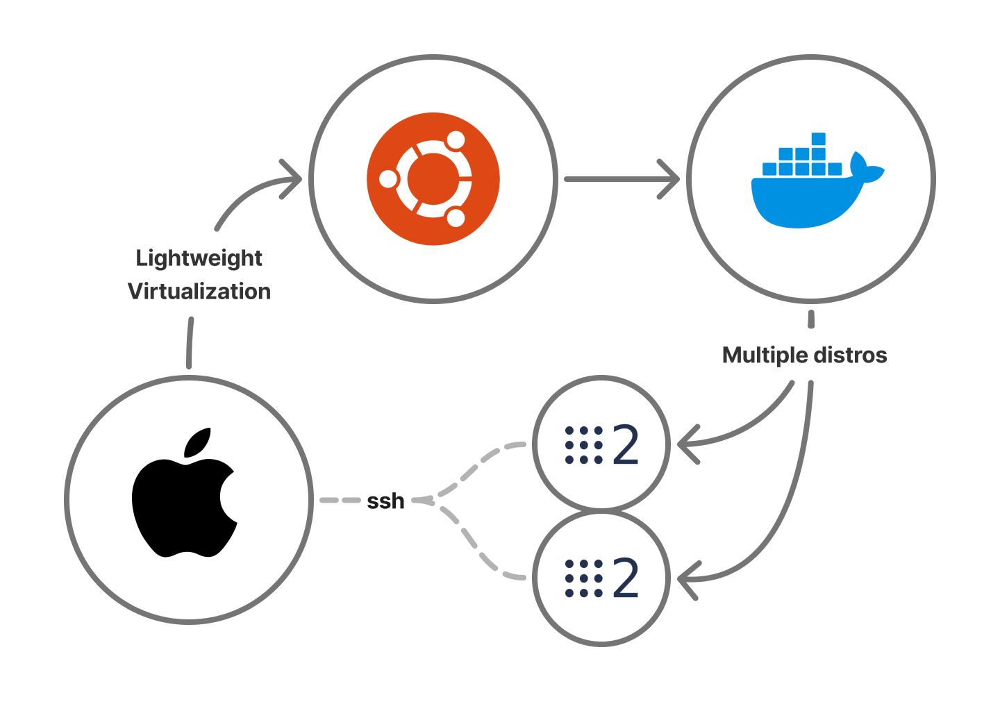

# DROPPED PROJECT (macos-vm-ros2)

## REASON OF PROJECT BEING DROPPED

The VM assigns itself a virtual MAC address using socket_vmnet in bridged mode over Wi-Fi. It then attempts to pass packets directly through the Mac's Wi-Fi card. This fails for two reasons:

Standard 802.11 Wi-Fi access points enforce a 1-to-1 mapping between the authenticated hardware MAC address of the Mac and the wireless connection. When the Wi-Fi router sees packets coming from the VM's virtual MAC address over the Mac's connection, it drops them.

And when your Mac tries to send a packet to the VM it sends an ARP request to find out who owns that IP. And because of the isolation layer, the Mac never receives the reply and thinks the IP is completely unreachable, and throws OSError: [Errno 65] No route to host.

The network bridge was broken from the get go by the wireless layer, so no amount of ROS 2 configuration tweaking inside the container will work.

---
A future solution could be implementing MAC Masquerading like VMware does.

---
## macos-vm-ros2

Lima VM customized for ROS2 development with VNC and capable of discovering topics of physical robots. My objetvive is to have a standard and production-level ROS 2 development environment on MacOS devices, with features including:
- A Lima VM running Ubuntu 24.04 LTS tailored for this purpose
- A containerized approach to work with multiple ROS 2 distro
- Work on native MacOS VSCode through ssh
- VNC server UI apps like rqt, Rviz and Gazebo
- Simple deployment and use

